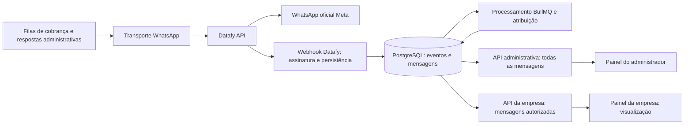

# Datafy e conversas por empresa no CifraMais

**Data:** 23/09/2026.  
**Estado:** proposta técnica; escopo de acesso confirmado pelo usuário. Implementação não iniciada por este documento.

## Objetivo e escopo confirmado

Operar a API oficial do WhatsApp por meio do Datafy API, usando um número compartilhado da CifraMais. O administrador da plataforma acompanha todas as conversas e responde. Cada empresa apenas consulta as mensagens atribuídas a ela, incluindo as respostas pertinentes às suas cobranças.

O isolamento é por mensagem e contexto comercial. O contato e o número de telefone não identificam uma empresa: a mesma pessoa pode receber cobranças de várias empresas no mesmo chat do WhatsApp.

Esta proposta atualiza a restrição de visualização do documento `2026-08-18-platform-communication-channels-design.md`. A solicitação atual também delimita um único número, sem implementar a antiga proposta de failover entre números. Os dados existentes serão preservados; a autorização antiga para descartar históricos não é aplicável a este trabalho.

## O que já existe no repositório

- `CommunicationConversation` representa o atendimento central; `CommunicationMessage` já possui `companyId`, `invoiceId`, `debtorId` e `externalMessageId`.
- `communications.controller.ts` já separa histórico de envios da empresa e operações do administrador, protegidas por `PlatformAdminGuard`.
- `CommunicationsHistory.tsx` é usado nas duas telas. A empresa vê envios; o administrador tem conversa e resposta.
- Respostas recebidas e respostas gerais do administrador atualmente ficam sem empresa. Atribuí-las apenas pelo telefone seria incorreto.
- `WhatsappService` concentra boa parte do acesso Graph, mas `MessagingLimitService` também possui uma chamada direta à Meta.
- O webhook atual verifica a assinatura Meta; seu processamento não cobre o contrato de assinatura do Datafy, eventos de templates sem `metadata.phone_number_id` e deduplicação completa dos efeitos sobre contadores.
- PostgreSQL, BullMQ, Redis, Nginx e HTTPS já estão disponíveis. A API roda com sistema de arquivos somente leitura, exceto `/tmp`.
- Há modelos e telas legados de inbox. A extensão será feita sobre `Communication*`, mantendo compatibilidade e evitando um terceiro histórico.

## Contratos verificados na documentação

1. O Datafy oferece um proxy para endpoints Meta em `https://cloud.datafyapi.com.br/v1/`, autenticado com seu próprio token Bearer. `GET /me`, fora de `/v1`, permite conferir os identificadores associados ao token. O `cliente_id` Datafy não representa uma empresa do CifraMais. [Introdução](https://developers.datafyapi.com.br/api-reference/whatsapp/introducao), [Identificação do canal](https://developers.datafyapi.com.br/api-reference/whatsapp/datafy/me).
2. Webhooks preservam o envelope Meta, mas usam headers Datafy. É necessário responder HTTP 200 em até 20 segundos; as retentativas são limitadas. [Recebimento de eventos](https://developers.datafyapi.com.br/api-reference/whatsapp/webhooks/receber-eventos).
3. A assinatura usa HMAC-SHA256 de `timestamp + "." + corpo original`, com segredo próprio do número. Não é a verificação de `META_APP_SECRET`. [Assinatura](https://developers.datafyapi.com.br/api-reference/whatsapp/webhooks/validar-assinatura).
4. A documentação publica limites por token: 500 requisições de envio/minuto, 60 de upload/minuto e 60 das demais requisições/minuto. A paginação deve repetir a chamada no Datafy com o cursor, sem seguir a URL Meta de `paging.next`. [Requisições e limites](https://developers.datafyapi.com.br/api-reference/whatsapp/visao-geral/requisicoes).
5. Uma resposta citando uma mensagem pode trazer `context.id`, permitindo localizar a cobrança de origem. Isso não existe obrigatoriamente em toda resposta. [Respostas contextuais](https://developers.datafyapi.com.br/api-reference/whatsapp/recursos/respostas-contextuais).
6. Templates continuam sujeitos à aprovação da Meta. Mensagens livres dependem da janela de atendimento de 24 horas, calculada pela última mensagem recebida do destinatário. Enviar template não reabre essa janela. [Templates](https://developers.datafyapi.com.br/api-reference/whatsapp/templates/criar-template), [Janela de atendimento](https://developers.datafyapi.com.br/guias/whatsapp/conceitos/janela-de-24-horas).
7. Há download autenticado de mídias em bytes. O sistema deve servir os arquivos por autorização própria, evitando usar URLs públicas do fornecedor como controle de acesso. [Download de mídia](https://developers.datafyapi.com.br/api-reference/whatsapp/datafy/baixar-arquivo-midia).
8. A sincronização de histórico documentada depende de coexistência e de condições de conexão. Não equivale a uma API geral de consulta de todo o histórico. [Sincronização de histórico](https://developers.datafyapi.com.br/api-reference/whatsapp/sincronizacao/sincronizar-historico).

Não foi identificado, nas páginas consultadas, um componente visual incorporável com autorização por empresa do CifraMais. O plano usa interface própria e histórico persistido no PostgreSQL.

## Arquitetura escolhida

### Transporte e configuração

Introduzir `WHATSAPP_TRANSPORT=META_DIRECT|DATAFY`, com `META_DIRECT` como padrão de compatibilidade. Acrescentar `DATAFY_API_TOKEN`, `DATAFY_WEBHOOK_SECRET` e `DATAFY_WEBHOOK_BASE_URL`. Em Datafy, o último terá valor `https://api.ciframais.com.br/webhooks/datafy`.

Reaproveitar `META_PHONE_NUMBER_ID` e `META_BUSINESS_ACCOUNT_ID` como identidade do número e WABA, conferidos com `/me`. O prefixo Meta identifica esses IDs, mesmo quando o transporte é Datafy. Não utilizar `META_GRAPH_API_VERSION` para montar a rota `/v1` Datafy.

Validar credenciais obrigatórias conforme transporte. Manter validações independentes de Resend, Efí e criptografia. Segredos ficam no ambiente do servidor, nunca em `NEXT_PUBLIC_*`, respostas da API ou logs. Destinos HTTP têm hosts e rotas permitidos; nenhuma URL de paginação pode redirecionar o token.

Uma interface interna de transporte concentra envio de texto/template, consulta/criação de templates, consulta do canal e obtenção de mídia. O domínio continua sendo WhatsApp oficial; não é necessário transformar cada empresa em uma conta Datafy.

### Recebimento confiável

Criar `POST /webhooks/datafy`, com `@HttpCode(200)`. Usar `rawBody`, já habilitado no bootstrap. Validar assinatura em tempo constante, formato de headers, timestamp inteiro dentro de 300 segundos e WABA/número esperado conforme o tipo de evento. Validar cada tentativa antes de consultar deduplicação.

Persistir a entrega em PostgreSQL antes de confirmar seu recebimento. A publicação em BullMQ ocorre a partir desse registro, com recuperação periódica dos pendentes; assim uma falha Redis após a gravação não perde o evento. Uma indisponibilidade do banco recebe resposta de erro, sem confirmação falsa.

Deduplicar tanto a entrega Datafy quanto os efeitos de cada mensagem/status. O mesmo evento pode reaparecer com outro identificador de entrega. Processar todos os itens de `entry`, `changes`, `messages` e `statuses`. Eventos de templates usam o WABA e não dependem de metadados de número.

Status não podem regredir de lido para enviado por atraso de evento. Falhas preservam código e horário para diagnóstico. Eventos desconhecidos ficam registrados para triagem; não devem ser transformados em mensagens vazias. Retentativas e mensagens mortas ficam sob controle local depois da confirmação ao fornecedor.

### Atribuição e autorização

| Situação | Visibilidade e regra |
| --- | --- |
| Cobrança enviada pela empresa A | Admin e empresa A; vínculo salvo antes de chamar o fornecedor. |
| Resposta que cita uma mensagem da empresa A | Atribuição a A quando número, destinatário e referência persistida coincidem. |
| Botão com referência opaca emitida para uma cobrança | Resolver no servidor e conferir destinatário e cobrança; não confiar em `companyId` do payload. |
| Mensagem sem referência, ainda que o telefone só tenha uma cobrança recente | Admin; classificação explícita por mensagem. |
| Resposta geral do administrador | Admin, salvo contexto de empresa selecionado e validado antes do envio. |
| Mensagem referente à empresa B no mesmo contato | Nunca aparece na projeção da empresa A. |
| Histórico importado sem vínculo comprovável | Admin até classificação; nenhuma atribuição por proximidade temporal. |

O administrador pode atribuir ou corrigir a atribuição de uma mensagem, com motivo e controle de concorrência. A operação valida os vínculos empresa/cobrança/devedor/destinatário e grava auditoria própria, inclusive quando não há empresa. O `AuditLog` atual exige `companyId`, portanto não serve sozinho para eventos globais sem empresa. Uma correção invalida caches e revisa referências dependentes; não espalha a nova empresa automaticamente para toda a conversa.

Na API da empresa, `companyId` vem da sessão autenticada. Todas as consultas filtram mensagens por esse valor antes de paginar, buscar ou agregar. Prévias, quantidade de mensagens, última atividade e trechos citados usam apenas mensagens acessíveis. O status global de atendimento e seus contadores não são retornados à empresa. Na primeira versão não haverá contador pessoal de não lidas nem marcação de leitura da Meta ao abrir a tela.

O administrador acessa rotas globais separadas, com `PlatformAdminGuard`. Não existe endpoint de envio autorizado a usuários de empresas. Conhecer um ID de conversa, mensagem, anexo ou cursor não concede acesso.

### Persistência e envio

Ampliar `CommunicationMessage` com identidade do canal, referência citada, tipo de conteúdo, horário do provedor, origem ao vivo/importada, método de atribuição e versão da atribuição. Reutilizar os vínculos de empresa já presentes. Preservar a identidade da conversa ao trocar o transporte do mesmo número.

Acrescentar registros para entrega de webhook, intenção de envio, auditoria de atribuição e anexos. Unicidade de entrega: transporte + canal + delivery ID; unicidade de mensagem: ID externo estável, independente de receber via Meta direta ou Datafy. Índices de leitura incluem empresa, conversa, horário e ID.

Cada intenção de envio possui chave idempotente e contexto imutável. Persistir antes da chamada, registrar o ID externo ao receber aceitação e acompanhar entrega por webhook. HTTP 200 do fornecedor não significa entregue. Timeout após transmissão ou queda depois da aceitação produz estado de resultado incerto; esse estado bloqueia reenvio automático e exige conciliação/triagem. Não existe promessa de entrega exatamente uma vez entre sistemas sem suporte do fornecedor.

Concentrar todos os envios, inclusive respostas do admin, no controle de taxa por token. Separar isso das cotas comerciais de cada empresa. Se Redis não estiver disponível, aguardar recuperação em vez de enviar sem controle. Retentativas com espera exponencial se aplicam a processamento idempotente e operações comprovadamente recusadas antes de aceitação; não a todo POST que falhou.

### Templates e interfaces

Reaproveitar `GlobalMessageTemplate`, preferências das empresas e painel administrativo de templates. Sincronizar criação, listagem paginada, aprovação/rejeição/pausa e alterações remotas. Nome e idioma identificam o template no WABA compartilhado. Preservar o formato de parâmetros atualmente utilizado; não migrar tudo para parâmetros nomeados.

No admin: listar conversas, filtrar por empresa/cobrança e pendências de classificação, ver o contexto de cada mensagem, atribuir mensagens, responder e selecionar template aprovado quando a janela livre estiver encerrada. Validar a janela novamente no momento real do envio pela fila.

Na empresa: acrescentar a visualização de conversas ao histórico existente, com mensagens autorizadas de entrada e saída, contexto da própria cobrança e status de entrega. Nenhum editor de resposta. Manter a consulta de e-mails atual.

Atualização inicial por consulta ao abrir a tela, botão Atualizar e polling de 15 segundos apenas com a tela visível. Não introduzir WebSocket ou um novo serviço de chat nesta etapa.

### Anexos e histórico anterior

A entrega inicial de conversas contempla texto e indicação de mensagens de outros tipos. A etapa seguinte permite consulta de imagens JPEG/PNG/WebP, PDF e áudio compatível, até 16 MiB por arquivo. Arquivos não suportados recebem indicação explícita, sem falhar a ingestão da mensagem.

O backend busca bytes pelo endpoint autenticado Datafy. Armazenamento privado em volume dedicado da API, com criptografia, limites de tamanho, verificação de tipo e acesso autenticado por mensagem. Não montar esse volume no Nginx como diretório público. Downloads não autorizados são recusados antes de buscar o conteúdo. Backups devem incluir arquivos e chaves necessárias à restauração. O limite de armazenamento operacional inicial proposto é 5 GiB, com alerta a 80%; ao atingir o limite, preservar a mensagem e indicar mídia indisponível, sem derrubar webhooks.

Preservar o prazo de retenção já configurado no sistema para mensagens; não tratar os cinco anos atuais como obrigação legal. Anexos herdam a expiração da mensagem. Replays/status não reiniciam retenção. Payload bruto de entrega é criptografado, tem prazo operacional de sete dias após sucesso e não aparece em logs; falhas pendentes exigem triagem antes da expiração. Deduplicação de efeitos continua apoiada nos IDs persistidos das mensagens.

Importação anterior é opcional e separada: verificar elegibilidade de coexistência antes de solicitar sincronização. Não desconectar o número de produção para forçar importação. Importações não abrem janela de atendimento, não aumentam contadores ao vivo e não disparam cobranças.

## Alternativas consideradas e limites

- **Interface própria sobre `Communication*`: escolhida.** Reaproveita o projeto e permite autorização por mensagem.
- **Incorporar uma tela externa:** não há contrato verificado de autorização por empresa nas páginas consultadas; não fundamentar o isolamento em filtros de uma interface externa.
- **Um número por empresa:** facilita separar conversas físicas, mas muda o modelo operacional confirmado pelo usuário e fica fora desta entrega.

A concentração em um número compartilha capacidade e reputação do canal. O CifraMais não controla a tela do WhatsApp do destinatário: ela continuará reunindo mensagens de todas as empresas naquele mesmo chat. O isolamento proposto vale para os painéis do sistema.

## Critério final de aceite

Duas empresas cobram o mesmo telefone. O admin acompanha tudo; cada empresa vê somente suas mensagens, anexos e contexto. Resposta citada é atribuída corretamente; resposta ambígua fica só no admin. Reentregas não duplicam mensagens, contadores nem cobranças. Templates e janela de atendimento são respeitados. A troca do transporte e o deploy manual preservam os fluxos de Efí, e-mail e os dados existentes.
