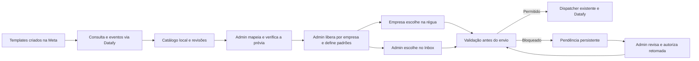

# Templates WhatsApp da Meta com liberação por empresa

**Data:** 27/09/2026.

**Estado:** especificação escrita aprovada pelo usuário em 27/09/2026. Implementação não iniciada. Plano técnico em `docs/superpowers/plans/2026-09-27-whatsapp-meta-catalog-company-grants.md`.

**Base inspecionada:** commit `e942e16` do repositório CifraMais.

**Escopo:** catálogo, mapeamento, autorização por empresa, seleção na régua e no Inbox, bloqueio de mensagens e retomada administrativa.

## 1. Objetivo e contexto do negócio

A CifraMais usa um número de WhatsApp compartilhado para comunicar cobranças de várias empresas. O administrador da plataforma opera o canal; cada empresa acompanha apenas seu próprio contexto comercial. A mesma pessoa pode receber cobranças de empresas diferentes no mesmo chat.

O proprietário criará e editará todos os templates no aplicativo da Meta. A CifraMais deve importar os aprovados, permitir que o administrador configure o preenchimento das variáveis e libere cada template para empresas específicas. Cada usuário empresarial poderá visualizar e escolher apenas os templates liberados para sua empresa.

O transporte continua exclusivamente pelo **Datafy**, inclusive na consulta do catálogo e no recebimento de eventos. Criar templates na Meta não implica adicionar integração Graph direta, outra credencial ou outro webhook ao backend.

O ambiente ainda contém apenas testes, sem operação com clientes reais. O usuário informou ter um template na Meta e autorizou remover os templates WhatsApp internos atualmente exibidos. Essa autorização não inclui excluir cobranças, clientes, conversas, comprovantes de envio ou templates de e-mail.

### Vocabulário

| Termo | Significado neste documento |
| --- | --- |
| Empresa | Cliente da CifraMais, dono das cobranças e do contexto de atendimento. |
| Devedor/destinatário | Pessoa que recebe a cobrança ou mensagem. Seu telefone não identifica uma empresa. |
| Catálogo global | Templates conhecidos da WABA compartilhada, acessíveis integralmente ao administrador. |
| Aprovação Meta | Situação do template no provedor; não concede acesso a nenhuma empresa. |
| Mapeamento | Associação de cada variável do template a um dado permitido, como nome do devedor ou valor da cobrança. |
| Liberação | Permissão concedida pelo administrador para uma empresa utilizar um template. |
| Finalidade | Uso comercial, como emissão de cobrança, pré-vencimento ou aviso de atraso. Não é o nome do template na Meta. |
| Pendência de envio | Registro persistente de uma mensagem impedida de seguir e que exige tratamento explícito. |

## 2. Decisões confirmadas com o usuário

1. A criação, edição e aprovação ocorrem na Meta. O administrador da CifraMais vê todos os templates aprovados encontrados na WABA pelo Datafy.
2. O administrador mapeia as variáveis ao configurar o template importado. O sistema não deduz que `{{1}}` sempre significa nome ou que `{{2}}` sempre significa valor.
3. A liberação é explícita por empresa. Uma nova empresa ou um template recém-importado começa sem liberações.
4. O administrador define os padrões por finalidade para cada empresa. A empresa pode selecionar outros templates liberados em sua régua.
5. A empresa apenas visualiza e escolhe templates WhatsApp. Não altera saudação, instruções, assinatura, texto aprovado ou mapeamento.
6. A primeira versão envia texto com variáveis, rodapé e botão para o link de pagamento. Outros formatos aprovados aparecem no admin como não suportados e não podem ser liberados para envio.
7. Revogação da liberação ou perda da aprovação bloqueia as mensagens afetadas ainda não enviadas. Não há substituição automática do template. A cobrança financeira continua existindo.
8. Corrigir uma pendência não dispara o estoque de mensagens automaticamente. O administrador revisa e autoriza a retomada; o sistema revalida a cobrança e as demais condições de envio.
9. No Inbox, o administrador pode responder livremente dentro da janela de atendimento de 24 horas. Fora dela, escolhe um template aprovado e liberado para a empresa vinculada ao atendimento.
10. A transição pode retirar o catálogo WhatsApp interno de testes e começar com as importações da Meta, sem migrar permissões automaticamente. Dados e referências históricas devem permanecer íntegros.

As escolhas técnicas das seções seguintes concretizam essas decisões. Elas não indicam funcionalidades já implementadas.

## 3. Abordagem escolhida

Usar um **catálogo local sincronizado** no PostgreSQL, aproveitando o transporte Datafy, o webhook e o fluxo persistente de envios existentes.

Consultar o provedor a cada abertura de tela tornaria a experiência dependente da latência e disponibilidade externas, sem resolver as liberações por empresa. Um catálogo exclusivamente manual perderia atualizações de status e importações. A sincronização local permite consultas rápidas, auditoria e validação comum entre telas e workers.

O catálogo é global por intenção. Liberações, padrões, escolhas de régua e pendências têm empresa definida. A autorização de acesso não pode depender de esconder elementos na interface.

## 4. Comportamento atual que precisa mudar

| Ponto inspecionado | Comportamento atual | Mudança necessária |
| --- | --- | --- |
| `templates.service.ts` | Semeia seis templates internos; ausência de preferência permite uso; sincroniza apenas registros já conhecidos. | Importar novos aprovados, retirar semeadura WhatsApp e exigir liberação explícita. |
| `template-provider-state.ts` | Compatibilidade baseada em texto local e variáveis nomeadas; trata eventos de registros existentes. | Interpretar componentes externos, variáveis posicionais, revisões e eventos de templates importados. |
| `datafy.transport.ts` | Consulta templates da WABA com paginação por cursor e devolve componentes. | Reutilizar e validar o contrato dos metadados necessários ao importador. |
| `GlobalMessageTemplate` | `slug` mistura identidade local e finalidade de cobrança. | Separar identidade no provedor, finalidade e configuração interna. |
| `CompanyTemplatePreference` | Guarda personalizações editáveis pela empresa e `isActive`. | Não usar preferência editável como permissão administrativa. |
| `CollectionRuleStep` | Tanto EMAIL quanto WHATSAPP referenciam `GlobalMessageTemplate`. | Separar referências e seleções de template por canal. |
| `message.worker.ts` e `billing.service.ts` | Resolvem templates por slugs e preferências; existem escolhas alternativas e fallback de e-mail em falhas. | Resolver padrão por empresa/finalidade ou escolha explícita; tratar bloqueio sem substituição. |
| `outbound-dispatcher.service.ts` | Valida estado do template; política `ADMIN_REPLY` dispensa certas verificações de preferência. | Aplicar liberação por empresa também a templates do Inbox, sem confundir com cotas ou regras de cobrança. |
| `communications.service.ts` | Recebe parâmetros do template e contexto opcional em alguns casos. | Usar mapeamento controlado e contexto empresarial obrigatório para templates neste fluxo. |
| `central-onboarding-notifications.ts` | Escolhe templates de aviso/lembrete por variáveis de ambiente e fornece parâmetros diretamente. | Resolver os templates pelo catálogo e pela configuração da empresa, sem dispensar mapeamento ou liberação. |
| `queue.controller.ts` | Retentativa chama `job.retry()`; controles atuais usam apenas autenticação JWT. | Impedir que retry genérico ou acesso empresarial contorne revisão administrativa de pendências. |
| Telas de templates e régua | Empresa personaliza WhatsApp; admin pode criar/submeter modelos; opções são compartilhadas entre canais. | Catálogo administrativo, empresa somente leitura/seleção e opções independentes por canal. |

O novo comportamento deve alcançar todos os produtores de mensagens que usam templates, incluindo cobrança inicial, régua, respostas administrativas e notificações auxiliares. Manter uma rota antiga de submissão ou um produtor com lista interna de templates deixaria um caminho paralelo ao desenho.

## 5. Catálogo e sincronização

### 5.1 Identidade e persistência

- Usar o ID do template no provedor e a identidade da WABA como identidade externa; armazenar também idioma, nome e transporte. O ID local permanece estável para referências internas.
- Nome, idioma e WABA são necessários para localizar eventos que não tragam o ID. Nunca resolver apenas pelo nome nem misturar duas contas do provedor.
- Finalidade de cobrança pertence à configuração interna. Não exigir que o template externo tenha um dos seis slugs históricos.
- Guardar status, categoria, qualidade, motivo de rejeição quando disponível, componentes recebidos, instantes de sincronização/evento e revisão de conteúdo.
- Preservar o conteúdo aprovado. O sistema não reescreve texto, rodapé ou URL-base para torná-los compatíveis.
- Restringir duplicação por identidade externa no banco. Duas sincronizações concorrentes não criam dois templates locais.

### 5.2 Importação e acompanhamento

A sincronização importa novos templates somente quando aprovados. Templates já importados continuam sendo acompanhados quando ficam pausados, rejeitados, desabilitados ou removidos. Filtrar a consulta inteira para apenas `APPROVED` impediria distinguir revogação de falha de consulta.

O admin abre o catálogo inicialmente filtrado pelos aprovados. Uma área de indisponíveis/histórico mantém os já importados que perderam aprovação, com seus impactos. Templates aprovados incompatíveis permanecem visíveis, com explicação do formato não suportado.

Proposta operacional: botão **Sincronizar com a Meta**, executado pelo Datafy, mais reconciliação a cada 15 minutos e eventos pelo webhook existente. O intervalo é uma configuração técnica, sem exigir uma chamada por empresa. Respeitar o controle de quota e a recuperação já existentes.

Regras de consistência:

- Paginar pelo cursor no host Datafy, sem seguir uma URL arbitrária de `paging.next`.
- Uma paginação incompleta, timeout ou erro não esvazia o catálogo nem marca ausentes como removidos. Somente uma varredura completa permite concluir ausência.
- Um resultado iniciado antes de um evento mais recente não pode restaurar um estado antigo. Comparar versões locais/instantes por campo; em conflito, preservar a restrição conhecida e reler o item.
- Evento de template desconhecido agenda reconciliação; não cria automaticamente um registro enviável a partir de payload incompleto.
- Exibir última sincronização concluída, falhas e origem do estado. Falha de sincronização não fabrica aprovação nem remove uma restrição conhecida.
- Importar ou sincronizar não concede liberação, não escolhe padrões e não retoma pendências.

### 5.3 Alterações na Meta e revisões

Identificar alterações relevantes por uma representação normalizada dos componentes, idioma, categoria e formato de parâmetros. Qualidade e horário de consulta, sozinhos, não mudam o mapeamento.

Se o conteúdo relevante mudar, marcar revisão necessária e impedir novos envios com a configuração antiga. O administrador compara o conteúdo novo, ajusta o mapeamento e confirma a prévia. Um evento posterior `APPROVED` não conclui essa revisão automaticamente.

Liberações e padrões podem continuar registrados, mas ficam sem efeito enquanto houver incompatibilidade, falta de aprovação ou revisão pendente. Retomar a disponibilidade para novas mensagens não libera mensagens que já ficaram bloqueadas.

A mensagem histórica conserva o template, a revisão e os valores usados no envio. Alterar o mapeamento atual não modifica o que aparece como enviado anteriormente.

## 6. Formatos, variáveis e prévia

### 6.1 Contrato da primeira versão

Suportar corpo de texto, com ou sem variáveis posicionais `{{1}}`, `{{2}}` etc.; rodapé de texto opcional; e, opcionalmente, um botão URL para o link de pagamento. O botão deve ter estrutura compatível com a URL de pagamento efetivamente gerada pela CifraMais.

Não incluir nesta entrega cabeçalhos de mídia, imagens, vídeos, documentos, carrosséis, múltiplos botões ou botões de tipos diferentes. Formatos de parâmetros não implementados, incluindo nomeados se retornados pelo provedor, devem aparecer explicitamente como não suportados. Não convertê-los silenciosamente para posicionais.

A apresentação de todos os aprovados no admin é obrigatória mesmo quando seu envio não for suportado. Texto de diagnóstico deve apontar o componente que impede o uso.

### 6.2 Mapeamento administrativo

Cada posição recebe uma fonte permitida. Exemplos:

| Variável externa | Fonte escolhida no admin | Exemplo de prévia |
| --- | --- | --- |
| `{{1}}` no corpo | Nome do devedor | Maria Exemplo |
| `{{2}}` no corpo | Nome da empresa | Empresa Exemplo |
| `{{3}}` no corpo | Valor da cobrança | R$ 150,00 |
| `{{4}}` no corpo | Vencimento | 05/10/2026 |
| Parâmetro do botão | Identificador/sufixo do link desta cobrança | Link de pagamento da fatura selecionada |

O significado depende da escolha do administrador, não da posição em si. Todas as ocorrências da mesma posição no corpo recebem o mesmo dado. Parâmetros do botão pertencem a outro componente e não compartilham índices implicitamente com o corpo.

Oferecer uma lista fechada de fontes: nome do devedor, nome da empresa, valor, vencimento, link de pagamento e os dados de Pix/boleto já disponíveis para a cobrança. Para os avisos de ativação já existentes, incluir o nome do representante a partir do contexto de ativação validado. Permitir texto fixo configurado pelo administrador dentro dos limites de parâmetros do provedor. Personalizações antigas da empresa não entram no novo renderizador.

Não aceitar expressões executáveis, caminhos livres para campos do banco, URLs arbitrárias ou valores fornecidos pelo usuário empresarial para substituir parâmetros no envio. O backend resolve os valores a partir do contexto autorizado. Datas e valores usam formatação brasileira e a referência temporal do negócio; uma data de vencimento não pode mudar de dia por conversão de fuso.

O mapa é global para aquela revisão do template. Dados como nome da empresa variam porque são lidos do contexto. Ter cópias de mapeamento por empresa não faz parte da primeira versão.

### 6.3 Validação e experiência

A tela mostra texto aprovado somente leitura, posições detectadas, seleção de fontes, rodapé e botão. Uma prévia com dados fictícios permite entender o resultado sem disparar mensagem. A prévia não prova que as credenciais ou o envio real funcionam.

Só marcar como configurado quando todas as posições forem atendidas e os componentes forem suportados. Validar novamente com dados reais no envio: falta de Pix, boleto, cobrança ou outro valor obrigatório gera pendência, sem texto vazio, `undefined`, substituição improvisada ou envio parcial.

Para o botão, combinar a base aprovada com o parâmetro esperado pelo provedor. Verificar que o resultado aponta para a cobrança e empresa corretas no domínio de pagamento autorizado. Não enviar uma URL completa como sufixo sem que esse seja o contrato aprovado.

## 7. Liberações, padrões e régua

### 7.1 Autorização

Criar um registro explícito de liberação com empresa, template, estado, versão e autoria/instantes de concessão e revogação. Manter auditoria das alterações e dos padrões. Preferência da empresa, URL ou payload não pode conceder esse acesso.

Acesso empresarial deriva da sessão autenticada. Mesmo conhecendo o ID de outro template ou empresa, o usuário não consegue listar, consultar prévia, associar à régua ou enviar conteúdo não liberado. O admin pode administrar todas as empresas mediante o guard de administrador da plataforma.

Um template só fica disponível para seleção/envio quando reúne:

**aprovação conhecida + formato suportado + revisão/mapeamento válido + liberação ativa para a empresa.**

As verificações de canal, destinatário, cobrança, consentimento e cotas existentes continuam se aplicando conforme a origem da mensagem.

### 7.2 Padrões por finalidade

Separar finalidade de nome externo. Preservar as finalidades de emissão, pré-vencimento, vencimento do dia, primeiro aviso de atraso, atraso recorrente e atraso crítico, conforme os produtores atuais. Aviso e lembrete de ativação financeira, já existentes, têm finalidades próprias e não reutilizam um padrão de cobrança. A ausência desses padrões impede apenas a respectiva mensagem WhatsApp; sua configuração não é exigida para as empresas que não utilizam esses avisos.

O administrador escolhe um template liberado como padrão de cada finalidade que a empresa utilizar. Um template pode atender mais de uma finalidade quando seu texto e dados exigidos forem adequados.

Em uma etapa WhatsApp, a empresa pode escolher **usar o padrão da finalidade** ou um template específico dentre os liberados. Persistir essa escolha explicitamente:

- Seleção específica resolve aquele ID, sem substituí-lo por padrão se ficar indisponível.
- Seleção por padrão resolve apenas o padrão da empresa e finalidade correspondentes.
- Padrão ausente ou inválido gera configuração pendente; não usar padrão global nem template de outra finalidade.

Quando uma mensagem entra no fluxo persistente, registrar o template e as revisões resolvidas. Mudar o padrão depois vale para novos agendamentos, sem reescrever mensagens já preparadas. Se a referência antiga ficar indisponível, ela entra em pendência para decisão administrativa.

### 7.3 Interface empresarial e separação do e-mail

Em **Templates**, a empresa vê apenas os WhatsApp disponíveis para ela, com texto, idioma e prévia. Não há edição de saudação, instruções, assinatura ou estado da liberação.

Em **Régua**, as opções dependem do canal. Uma etapa com referência WhatsApp revogada permanece visível com aviso de configuração pendente, preservando ordem, atrasos e histórico. Ela não pode ser salva como válida nem executada enquanto estiver sem configuração utilizável.

O e-mail continua usando `GlobalEmailTemplate` e suas preferências. Criar referência de template de e-mail própria na etapa e adaptar resolutores e DTOs. Antes de retirar o catálogo WhatsApp legado, converter as referências EMAIL existentes pelo vínculo/slug correspondente, preservando o template efetivamente utilizado. Se houver ambiguidade ou referência sem correspondência, interromper essa conversão com diagnóstico, sem descartar a etapa.

Uma restrição de template WhatsApp não deve acionar o fallback automático de e-mail do worker. Essa é a concretização técnica do bloqueio para revisão. Etapas de e-mail já programadas de forma independente continuam com suas próprias regras.

## 8. Bloqueio e retomada sem duplicação

### 8.1 Validação no caminho real de envio

Usar uma política comum na configuração, preparação e transmissão. A decisão final permanece no `OutboundDispatcherService`, imediatamente antes da chamada externa. Aplicar a política a cobrança inicial, régua, Inbox, produtores auxiliares, recuperação de intenções e retries.

Persistir empresa, template, revisão do provedor, revisão do mapeamento e versão da liberação associadas à preparação. Jobs antigos que só carregam nome e parâmetros não recebem autorização implícita: devem ser revalidados ou encerrados como pendência de migração.

Revogar uma liberação, perder aprovação ou exigir nova revisão deve registrar uma restrição versionada e alcançar o trabalho ainda não transmitido. Se a permissão for concedida novamente antes que um job antigo rode, a mudança de versão ainda deve impedir retomada silenciosa desse job.

Revalidação e aquisição da intenção para transmissão precisam ter uma ordem definida em relação à revogação no banco. Uma revogação confirmada antes da autorização final bloqueia o envio. Uma chamada já iniciada ou aceita pelo provedor não pode ser recolhida; registrar esse limite e preservar o resultado real.

### 8.2 Pendência persistente

Adicionar estado de bloqueio por política separado de `PENDING`, para não entrar na recuperação automática a cada 10 segundos. A pendência deve existir mesmo quando a cobrança ficou sem template antes de criar uma intenção.

Identificar a comunicação pela chave lógica de envio existente, com empresa, fatura quando aplicável e etapa/origem. Avisos de ativação e respostas administrativas conservam suas próprias identidades de operação, sem criar uma fatura fictícia. Registrar motivo estruturado, contexto, referência e revisões, intenção quando houver, horários, resolução e auditoria. Exemplos de motivos: sem padrão, não liberado, não aprovado, formato não suportado, revisão necessária ou dado obrigatório ausente.

Operações concorrentes precisam produzir uma única pendência ativa para a mesma comunicação. Reexecuções do cron ou BullMQ atualizam o diagnóstico de forma controlada, sem criar mensagens ou alertas repetidos. A fatura não muda de situação financeira por esse bloqueio.

O admin vê pendências agrupadas por empresa/template/motivo, com contagem e acesso aos itens. A empresa vê o impedimento de suas próprias mensagens e a necessidade de ajuste administrativo, sem dados de outras empresas.

### 8.3 Revisão e retomada

1. O admin corrige mapeamento, aprovação, liberação, padrão ou escolha da etapa.
2. Seleciona pendências e solicita uma prévia da retomada. Ela apresenta template resolvido, cobrança, destinatário e resultado esperado da revalidação.
3. Itens pagos, cancelados, já enviados ou sem elegibilidade não são transmitidos. O sistema registra o motivo de encerramento ou mantém a pendência quando a correção ainda é possível.
4. O admin confirma os itens elegíveis. A confirmação tem chave idempotente e versões; alteração relevante desde a prévia exige nova revisão.
5. O backend registra autorização e transição na mesma transação e agenda usando a recuperação persistente existente. Perda do Redis após o commit não perde nem duplica a retomada.
6. O worker revalida novamente no momento de enviar, inclusive estado da fatura quando aplicável, opt-in/opt-out, destinatário, contexto, template, liberação, pausa de canal, horário permitido e cotas aplicáveis. Respostas sem cobrança e avisos de ativação seguem a elegibilidade de suas origens, sem fabricar a exigência de uma fatura.

Trocar o template de uma pendência é uma decisão explícita na revisão, limitada aos liberados. Não editar silenciosamente o payload de uma intenção existente: preservar a tentativa original e, quando necessário, criar uma geração sucessora vinculada à mesma comunicação e à autorização. Apenas uma geração pode ser elegível para transmissão de cada vez.

`ACCEPTED` não pode ser retomada. `SENDING` precisa concluir seu ciclo; `UNCERTAIN` exige triagem própria e nunca vira reenviável por uma correção de template. Conservar o tratamento de aceitação tardia pelo provedor. Esta entrega não promete entrega exatamente uma vez diante de resultado externo desconhecido.

Restringir os controles globais de fila ao administrador e fazer o retry genérico respeitar o estado persistido. Mesmo o admin não pode usar `job.retry()` para pular a revisão da pendência. A proteção principal fica no backend/dispatcher, não no botão.

## 9. Inbox administrativo

O Inbox empresarial continua somente para consulta. O administrador mantém respostas livres dentro da janela de atendimento calculada pela última mensagem recebida do destinatário. Enviar um template não reabre essa janela. O worker confere a validade novamente, pois ela pode terminar enquanto a mensagem aguarda na fila.

Fora da janela, apresentar os templates liberados para a empresa do contexto selecionado. Em um chat compartilhado por cobranças de várias empresas, exigir seleção inequívoca de contexto; não inferir a empresa pelo telefone.

Para templates, a empresa do contexto é obrigatória. A cobrança também é obrigatória quando qualquer variável ou botão depender dela. Validar o pertencimento entre empresa, devedor e fatura. As fontes configuradas preenchem os parâmetros no servidor, inclusive para respostas do administrador.

A política `ADMIN_REPLY` pode conservar diferenças próprias de quotas e elegibilidade em relação a uma cobrança automática. Ela não dispensa aprovação, liberação por empresa, mapeamento ou contexto do template. Texto livre não exige liberação de template, mas preserva as demais proteções de envio existentes.

## 10. Fronteiras técnicas e contratos

### 10.1 Dados propostos

Os nomes abaixo descrevem responsabilidades; o plano técnico definirá nomes finais e migrations sem duplicar o histórico existente.

| Responsabilidade | Dados e garantias |
| --- | --- |
| Catálogo WhatsApp | Identidade da WABA/provedor, ID local estável, componentes e status; unicidade externa. Evoluir `GlobalMessageTemplate`. |
| Revisão e mapeamento | Fontes por componente/posição, impressão do conteúdo, versão e responsável pela revisão; histórico utilizado por mensagens. |
| Liberação por empresa | Empresa + template únicos, estado/versionamento e auditoria; somente admin altera. |
| Padrão por finalidade | Empresa + finalidade únicos; referência a template liberado e compatível. |
| Etapa da régua | Canal, finalidade quando usa padrão, modo de seleção, referência WhatsApp ou e-mail coerente com o canal. |
| Pendência e retomada | Chave lógica, motivo, contexto, revisões, autorização administrativa e vínculos com gerações de intenção. |
| Intenção existente | Referências/versionamento necessários, bloqueio por política e associação à retomada; preservar criptografia, leases e idempotência. |

Não apagar `CompanyTemplatePreference` indiscriminadamente: ela também participa do e-mail. As personalizações WhatsApp antigas deixam de autorizar ou alimentar envios; referências necessárias ao histórico podem permanecer arquivadas.

### 10.2 Serviços e APIs

Separar catálogo/sincronização, validação/renderização do mapeamento e política de acesso/defaults em unidades pequenas reutilizadas pelos produtores. Pendências e retomadas se apoiam no ledger de comunicação e no dispatcher existentes; não criar outro transporte nem uma segunda fila independente para o mesmo envio.

Contratos necessários:

- **Admin:** consultar catálogo completo, sincronizar, inspecionar compatibilidade, salvar/revisar mapeamento e prévia, administrar liberações e padrões por empresa, consultar pendências e confirmar retomadas.
- **Empresa:** consultar catálogo autorizado e prévias, consultar configuração da régua e selecionar templates permitidos. Sem operações de criação, submissão, mapeamento ou concessão de acesso.
- **Inbox:** consultar opções pelo contexto e enviar template pelo mapeamento aprovado; texto livre mantém seu contrato com a validação de janela.
- **Internos:** resolver template para uma empresa/finalidade ou seleção explícita, avaliar permissão versionada e renderizar a mensagem com dados autorizados.

As rotas antigas de criar/submeter WhatsApp pela CifraMais devem ser removidas ou responder explicitamente como indisponíveis, sem continuar criando no provedor. A sincronização e a revisão antigas devem convergir para os novos serviços. Os endpoints de e-mail não mudam de finalidade.

Erros retornam código estável e mensagem acionável. Conflitos de versão pedem atualização da prévia. Uma negativa de acesso não deve revelar a configuração de outra empresa. Logs registram IDs internos, códigos e revisões, sem tokens, certificados ou corpos completos de mensagens.

## 11. Transição do catálogo atual

Esta é uma migração controlada de um ambiente de testes. Não requer manter duas experiências de criação WhatsApp em paralelo.

1. Levantar templates atuais, referências de régua/EMAIL, mensagens, jobs e intenções. Verificar também a aplicação da correção anterior das referências de régua; o merge local não comprova o deploy na VPS.
2. Preparar e testar backup/restore. Pausar a preparação e transmissão WhatsApp durante a mudança, incluindo retries e recuperação.
3. Aplicar alterações de estrutura e converter referências EMAIL de forma verificável, preservando IDs das etapas, ordem, atrasos acumulados e tentativas existentes.
4. Retirar os templates WhatsApp internos da listagem e seleção. Arquivar os referenciados por histórico; excluir fisicamente somente registros dispensáveis e sem referências. Não semear novamente os seis modelos na inicialização.
5. Etapas WhatsApp antigas ficam com pendência explícita de seleção. Preservar sua posição temporal; desativá-las ou removê-las não pode antecipar as etapas seguintes. Não escolher automaticamente o único template importado.
6. Encerrar como substituídos na migração os jobs de teste comprovadamente não transmitidos, ou convertê-los em pendências. Preservar enviados e resultados incertos. Não executar limpeza geral de Redis ou do banco.
7. Publicar backend e frontend compatíveis mantendo WhatsApp pausado. Importar os aprovados pelo Datafy; confirmar que o template real aparece com seus componentes e idioma.
8. Configurar mapa e prévia, liberar para as empresas de teste, definir padrões e ajustar suas réguas. Não liberar automaticamente para todas as empresas.
9. Executar a validação de isolamento, do Inbox e de pendências antes de reabrir os envios. Realizar disparos de teste apenas com destinatários controlados e uma ação explícita de envio.

O roteiro executável de deploy virá no plano técnico/runbook. Não gerar instrução de voltar apenas a imagem antiga após alteração do schema. Uma reversão deve considerar compatibilidade de banco, jobs e estados de envio; restaurar backup após transmissão real pode reintroduzir trabalho já enviado.

## 12. Etapas de desenvolvimento propostas

Esta sequência organiza a futura implementação; não substitui o plano técnico com tarefas e comandos.

1. **Modelo e transição:** separar e-mail, criar liberações/defaults/revisões/pendências e converter referências com diagnóstico.
2. **Catálogo externo:** importação paginada, reconciliação, eventos, classificação de formatos e retirada da semeadura/submissão interna.
3. **Mapeamento e prévia:** fontes permitidas, renderizador por componente, revisão de mudanças externas e validação de dados reais.
4. **Admin e empresa:** telas/contratos de catálogo, liberações, padrões e visualização empresarial; seleção da régua por canal.
5. **Envios e Inbox:** aplicar a política comum em todos os produtores e no dispatcher, com contexto empresarial e versão da permissão.
6. **Pendências e retomadas:** estado durável, revisão manual, idempotência, recuperação após falha e proteção dos retries existentes.
7. **Validação e publicação:** testes integrados, prova de leitura do template real, migração ensaiada e runbook de deploy.

Nenhuma etapa que exponha um template a empresas deve ser publicada isoladamente antes da proteção efetiva no backend e no worker.

## 13. Critérios de aceite e testes

### Catálogo e configuração

- Sincronização importa o template aprovado existente na Meta sem exigir criação local anterior; repetição e concorrência não duplicam registros.
- Todos os aprovados aparecem no admin, inclusive formatos não suportados; nenhum é liberado automaticamente.
- Paginação parcial preserva registros. Reconciliação completa detecta desaparecimento. Evento posterior não é sobrescrito por consulta antiga.
- Variáveis posicionais, posições repetidas e parâmetro do botão são renderizados corretamente. Mapa incompleto, componente incompatível ou URL divergente impede liberação/envio.
- Mudança de conteúdo/categoria relevante exige nova revisão; apenas receber `APPROVED` não libera o mapa anterior.

### Isolamento e escolhas

- Com empresas A e B, liberar um template somente para A. B não o lista, não consulta sua prévia e não o utiliza enviando diretamente seu ID à API.
- Usuário de A não concede liberações, altera mapa, escolhe contexto de B nem retoma pendências administrativas.
- Padrões por finalidade resolvem dentro da empresa. Escolha explícita indisponível não migra para outro template.
- E-mail mantém seus templates, personalizações e etapas após a retirada dos templates WhatsApp internos.

### Bloqueio e recuperação

- Revogar depois do agendamento e antes da transmissão impede a chamada Datafy. Reativar antes de o job rodar não apaga o bloqueio versionado.
- Corrigir o template não dispara pendências. Retry genérico, recuperação de intenções e reinício de worker também não contornam a revisão.
- Duas revisões/retomadas concorrentes produzem uma única autorização efetiva e uma única geração elegível de envio. Alteração desde a prévia causa conflito.
- Cobrança paga/cancelada, opt-out, falta de consentimento ou janela/horário inadequado são reavaliados antes de enviar. Bloqueio WhatsApp não provoca fallback automático de e-mail.
- Perda da fila após autorização é recuperada pelo estado persistido. Falha de transação não deixa autorização sem auditoria nem contadores consumidos indevidamente.
- `ACCEPTED`, aceitação tardia, `SENDING` e `UNCERTAIN` mantêm as garantias atuais; nenhuma retomada administrativa duplica envio cujo resultado seja conhecido como aceito ou ainda desconhecido.

### Inbox e migração

- Texto livre funciona dentro da janela e é impedido fora dela, inclusive quando a janela termina durante a espera na fila.
- Fora da janela, template exige empresa selecionada e liberação correspondente; dados de fatura exigem fatura daquela empresa/devedor.
- Migração preserva tentativas, mensagens, faturas e tempos relativos da régua. Referências EMAIL sem correspondência interrompem a conversão com diagnóstico.
- Reiniciar a aplicação não recria os seis templates internos. Jobs legados não enviam parâmetros antigos sem passar pelas novas regras.

Combinar testes unitários das políticas/renderização, integração PostgreSQL para unicidade/concorrência/rollback e migração, Redis/BullMQ para recuperação, testes HTTP de autorização e testes de interface dos principais fluxos. Utilizar banco isolado e descartável; não rodar testes destrutivos contra a VPS ou banco de desenvolvimento compartilhado.

## 14. Limites e pontos de verificação técnica

- O estado local acompanha eventos e sincronizações; não é uma confirmação em tempo real da Meta para cada envio. O provedor pode recusar uma mensagem que parecia elegível. Essa recusa deve atualizar o diagnóstico sem troca automática de template.
- O adapter atual já consulta componentes de templates pelo Datafy. Antes de fechar o contrato de importação, validar em leitura o payload real do template aprovado, especialmente ID, idioma, formato de parâmetros e URL dinâmica. Não afirmar suporte a campos não observados/documentados.
- A política de janela de 24 horas foi conferida na fonte oficial abaixo. Compatibilidade dos formatos escolhidos e limites de parâmetros devem ser confirmados no contrato usado pelo Datafy durante a implementação.
- Não fazem parte desta entrega: criar/editar templates na CifraMais, integrar diretamente com a Meta, números próprios por empresa, mídia em templates, personalização WhatsApp pela empresa, troca automática de template ou retomada automática de pendências.
- Esta mudança não altera a emissão financeira, split, repasse, certificados Efí ou autorização para abrir contas. Afeta a comunicação das cobranças e a escolha dos templates.

## 15. Fontes e pontos de entrada no repositório

- [Política oficial do WhatsApp Business](https://whatsappbusiness.com/policy/), seção de mensagens: janela de atendimento e uso de templates fora dela. Consulta em 27/09/2026.
- [Introdução Datafy API](https://developers.datafyapi.com.br/api-reference/whatsapp/introducao): referência de integração. O conteúdo desta página não foi revalidado nesta rodada; os contratos atuais foram conferidos no adapter e no runbook do projeto.
- `api-cobranca/prisma/schema.prisma`: catálogo, preferências, régua e intenções persistentes.
- `api-cobranca/src/templates/`: catálogo atual, controllers, DTOs, compatibilidade e eventos.
- `api-cobranca/src/whatsapp/transport/datafy.transport.ts` e `README.md` da mesma pasta: transporte, paginação e garantias de envio existentes.
- `api-cobranca/src/whatsapp/outbound-dispatcher.service.ts`: autorização final e ciclo de transmissão.
- `api-cobranca/src/queue/workers/message.worker.ts` e `api-cobranca/src/queue/queue.controller.ts`: produtores, fallback e retry.
- `api-cobranca/src/billing/billing.service.ts` e `collection-profile.service.ts` da mesma pasta: resolução, criação e edição da régua.
- `api-cobranca/src/communications/communications.service.ts`: contexto e respostas do Inbox.
- `api-cobranca/src/efi-onboarding/central-onboarding-notifications.ts`: avisos de ativação que também passam pelo dispatcher.
- `front-cobranca/src/app/(dashboard)/admin/templates/page.tsx`: catálogo administrativo atual.
- `front-cobranca/src/app/(dashboard)/configuracoes/templates/page.tsx` e `configuracoes/regua/page.tsx`: experiência empresarial atual.
- `docs/operations/collection-rules-global-templates.md`: correção anterior das referências da régua, que deve ser considerada na migração.
